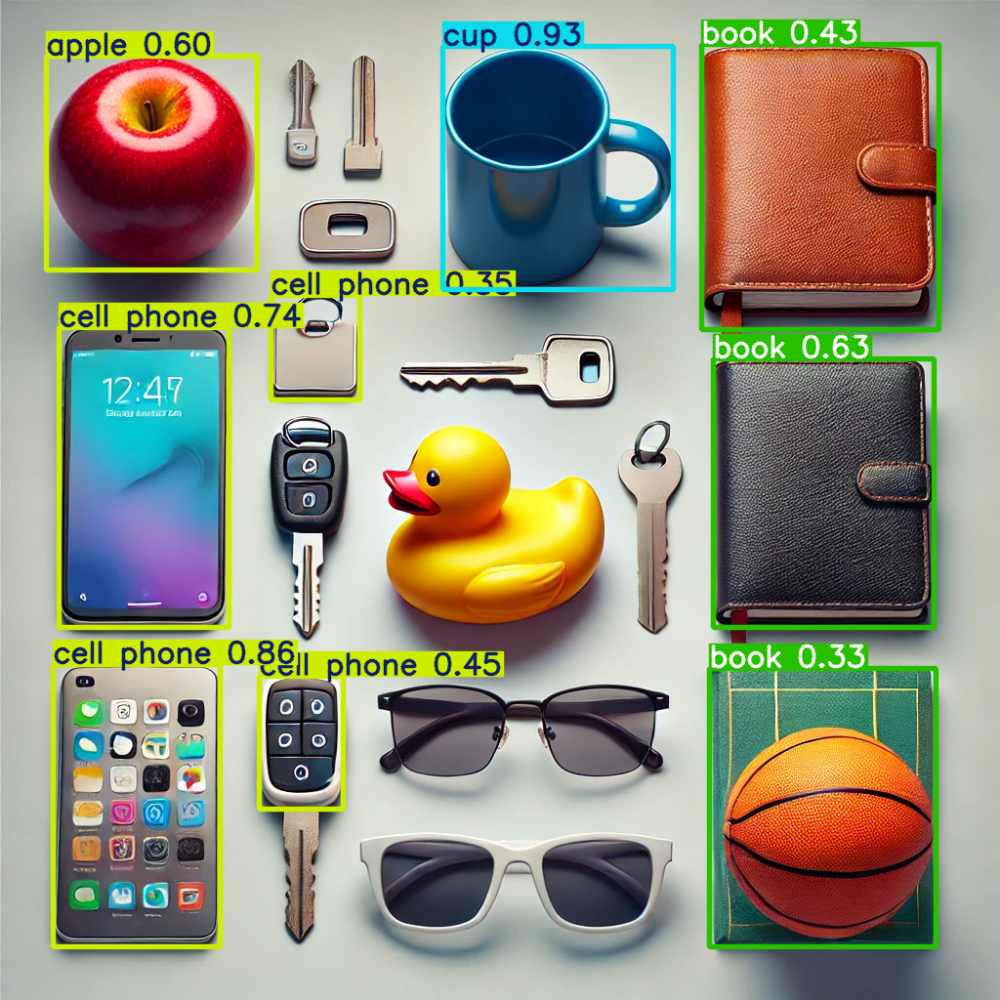

# indexify-detect-image-objects

Sample project example using ultralytics, opencv, indexify-server 0.2.3, indexify 0.2.17, and poetry.

## Example

### Input

### Output

## Setup

1. Instal poetry

## Local run

1. `python graph.py`: Runs the graph locally for local testing and debugging. Displays the output image on completion.

## Remote run

1. Setup two terminals opened in the poetry managed virtualenv
1. Terminal 1: `indexify-cli server-dev-mode` -> Starts the indexify server with the python executor.
1. Terminal 2: `python graph.py remote` -> Deploy the graph definition on the indexify server, runs the graph the input image, displays the output images on completion.